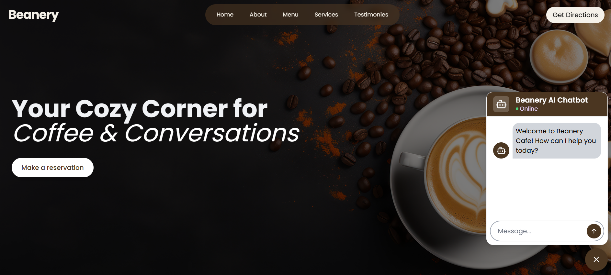
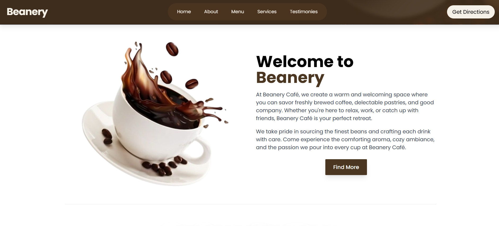
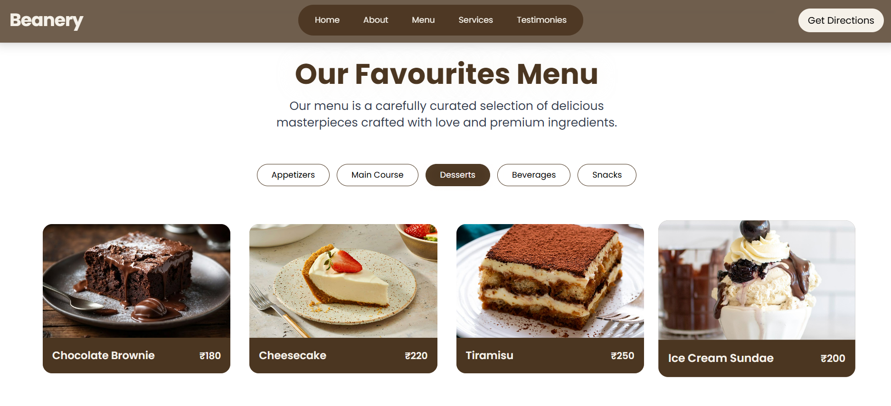

# Beanery – Cafe Landing Page

Welcome to **Beanery**, a modern and responsive landing page for cafes and small businesses. This project showcases a clean UI, interactive sliders, and smooth navigation to highlight products, deals, and services.

---

## 📸 Screenshots

### Home Page

### About Section

### Menu Secition

---

## 🌍 Live Demo

You can view the live website here !
[https://lumi-glow.vercel.app/](https://beanery.vercel.app/)

---

## 🛠 Tech Stack

- **React** – Frontend library for building UI components  
- **Tailwind CSS** – Utility-first CSS framework for styling  
- **Swiper** – Responsive sliders and carousels  
- **Lucide** – Simple, customizable SVG icons  

---

